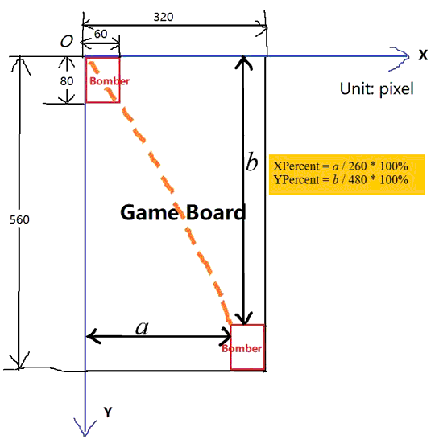

# Game of Bombers


## GameAPI (v.4 BETA)

The GameAPI v.4 is released.

> WARNING: this is still BETA version since there are still bugs in the game. But you can start to use the new feature (i.e. the laser beam). Robbin will try to debug by Oct 29.

Since there are quite a few bugs in the original game, Robbin tried hard to develop this API while fixing the bugs at the same time. And he decided to deliver the GameAPI in several releases.

The v.4 BETA gives you these functions:

+ ```GameAPI.StartGame(): void```  
 Start the bomber game.

+ ```GameAPI.StartFire(): void```  
  Let the bomber starts firing. The bomber initially does not fire.

+ ```GameAPI.CeaseFire(): void```  
  Let the bomber cease fire.

+ ```GameAPI.SetBulletSpeed(speed: Number): void```  
  Set the speed at which bullets are generated. The unit for speed is **(number of bullets)/second**. For good user experience, Robbin recommends you set a value larger than 33.

+ ```GameAPI.AllowCursorControlOnBomber(IsAllow: Boolean): void```
  This controls whether the bomber can be controlled by mouse cursor (the original game feature).

+ ```GameAPI.BomberMovesUpBy(distance: Number): void```  
  Makes the bomber move up by a certain ```distance``` (unit: pixel).

+ ```GameAPI.BomberMovesDownBy(distance: Number): void```  
  Similar to ```GameAPI.BomberMovesUpBy()```.

+ ```GameAPI.BomberMovesLeftBy(distance: Number): void```  
  Similar to ```GameAPI.BomberMovesUpBy()```.

+ ```GameAPI.BomberMovesRightBy(distance: Number): void```  
  Similar to ```GameAPI.BomberMovesUpBy()```.

+ ```GameAPI.SetBomberPosition(XPercent: Number, YPercent: Number): void```  
  Use the two percentage values to set the bomber's position on the game board. ```XPercent``` is the proportion of the distance between bomber's **left** boarder and the game board's **left** boarder, with respect to the full horizontal range of the bomber (=260px). ```YPercent``` is the proportion of the distance between bomber's **top** boarder and the game board's **top** boarder, with respect to the full vertical range of the bomber (=480px). 

  

+ ```GameAPI.BomberFiresLaser(IsFireLaser: Boolean): void```  
  This method controls the bomber to start or stop firing laser beam. For example, by passing the parameter ```IsFireLaser``` as ```true```, you enable the bomber to fire laser.

## Extra Note: 
  > **How to Import Javascript Module from external javascript file into ```<script>``` tag of HTML file?**
 
  > Ans: add ```type="module"``` to script tag. it will work. See [StackOverflow](https://stackoverflow.com/questions/62783429/how-to-import-javascript-module-from-external-javascript-file-into-script-tag).
  
  e.g.
  ```js
  <script type="module">    
     import JSZip from '../node_modules/jszip/dist/jszip.min.js';
  </script>
  ```
 
  > **I download a copy of this repo. But the browser reports an error loading JS modules and cannot load the game. What's wrong?**  
  
  > Ans: You may try to put the whole repo on a Web Server so that all files come from the same origin. Loading JS module files from local file system is currently banned due to security concerns.
 
  > **How will we combine our JS code together?**

  > Ans: We will use [Webpack](https://webpack.js.org/guides/getting-started/).
 
 

## Useful Information

+ This is a *multimodal* JavaScript game, built for fulfilling course requirement of CS3483 *Multimodal Interface Design* 

+ Credit: We would like to give thanks to [zds-d](https://github.com/zds-d/planeGame.git), upon whose project was this game built. 
